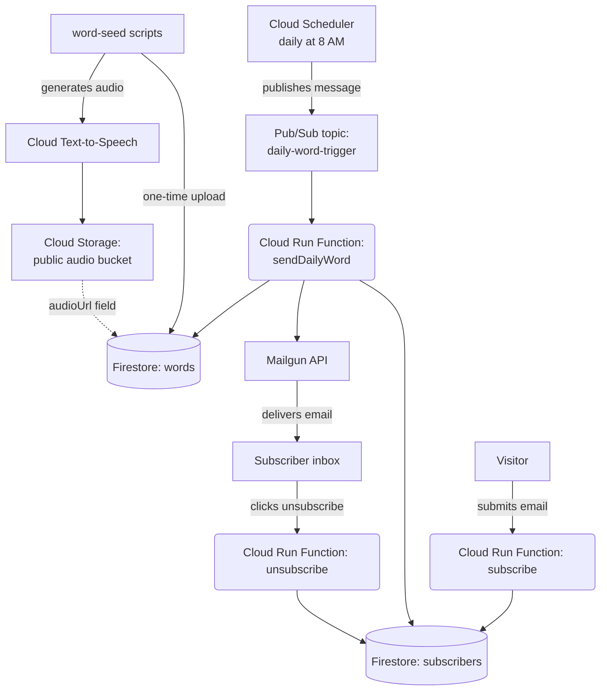

# Conquer English — Word of the Day

A serverless email app that sends subscribers one new English word every morning — meaning, part of speech, an example sentence, and a spoken pronunciation clip. Built entirely on Google Cloud's free tier (hopefully... utilizing the free usage limits while it lasts :wink:), with Mailgun for email delivery and Cloudflare for DNS.

**Live site:** https://rokin.com.np

---

## How it works

1. A visitor signs up on the Firebase-hosted signup page → `subscribe` writes their email to Firestore.
2. Cloud Scheduler fires once a day → publishes to a Pub/Sub topic → triggers `sendDailyWord`.
3. Cloud Run Function `sendDailyWord` pulls the next unsent word from Firestore, pulls all active subscribers, and sends a templated HTML email via Mailgun to everyone in one batched call.
4. The email includes a "Hear it pronounced" link pointing at a pre-generated audio clip generate using Cloud Text to Speech and hosted in Cloud Storage.
5. Clicking "Unsubscribe" in the email hits the `unsubscribe` Clound Run Function, which marks the subscriber as inactive in Firestore.

---

## Tech stack

| Layer | Technology |
|---|---|
| Compute | Cloud Run Functions (Node.js 24) |
| Database | Firestore |
| Scheduling | Cloud Scheduler + Pub/Sub |
| Email delivery | Mailgun |
| Text-to-speech | Cloud Text-to-Speech (Chirp 3: HD voice) |
| Audio hosting | Cloud Storage |
| Secrets | Secret Manager |
| Frontend hosting | Firebase Hosting |
| DNS | Cloudflare |
| Domain | [Mercantile](https://www.mercantile.com.np/) |

---
